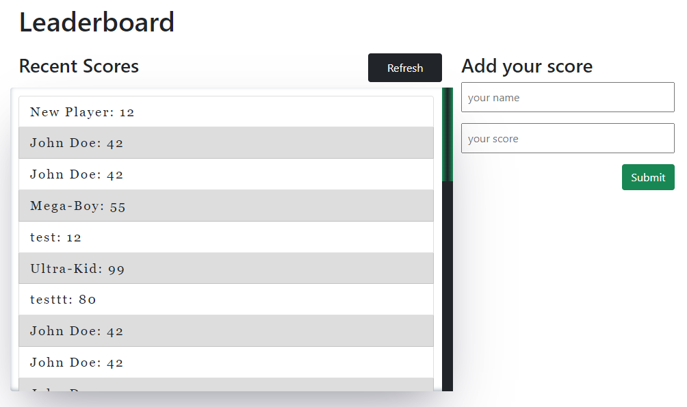

# Leaderboard App Project

> Evren Ersoy  Leaderboard app project. An app for using API

 

Additional description about the project and its features.

## Built With

- HTML5 
- SCSS
- Javascript
- Bootstrap 5
- Webpack 5
- API

## Live Demo

You can check the link below for the live demo.
https://ewoskyx.github.io/leaderboard/

## Getting Started

To get a local copy up and running follow these simple example steps.

### Setup
- Simply clone the project (for more information please check the link https://docs.github.com/en/repositories/creating-and-managing-repositories/cloning-a-repository
- Run the cmd promt
- Type "npm install" for the dependencies

### Install

Not required

## Author

👤 **Evren Ersoy**

- GitHub: [https://github.com/Ewoskyx]
- Twitter: [https://twitter.com/Ewoskyx]
- LinkedIn: [https://www.linkedin.com/in/evren-ersoy-206510179/]

## Show your support

Give a ⭐️ if you like this project!

## Acknowledgments

- Original design idea by Microverse leaderboard app project

## 📝 License
This project is [MIT](./MIT.md) licensed.